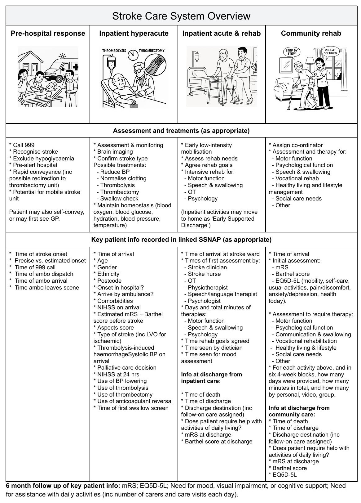

# CASCAIDE-SIM NIHR Programme Grant Bid

CASCAIDE-SIM uses advanced causal AI and clinical pathway simulation with NHS stroke data to identify which care factors most impact recovery and resources, aiming to improve outcomes, reduce disparities, and enhance efficiency across the entire stroke care pathway.

